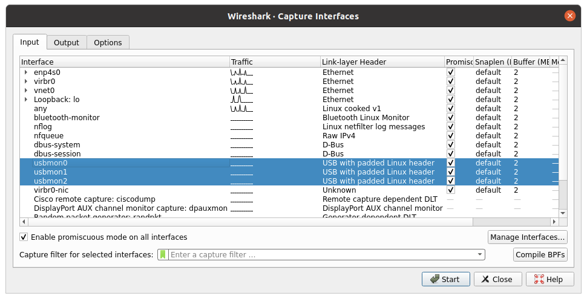
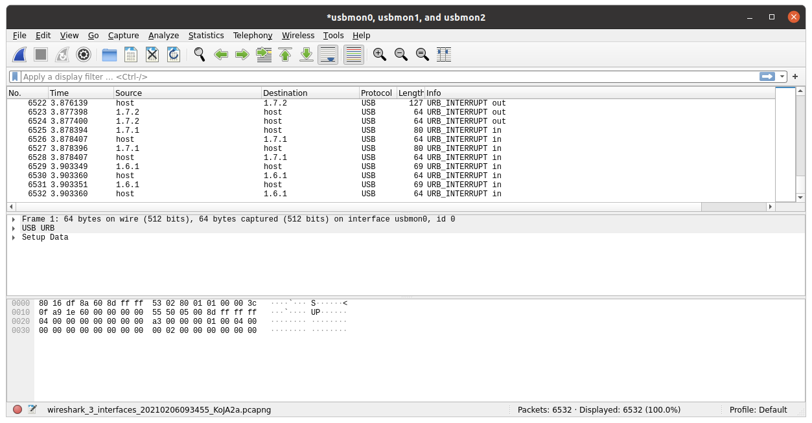
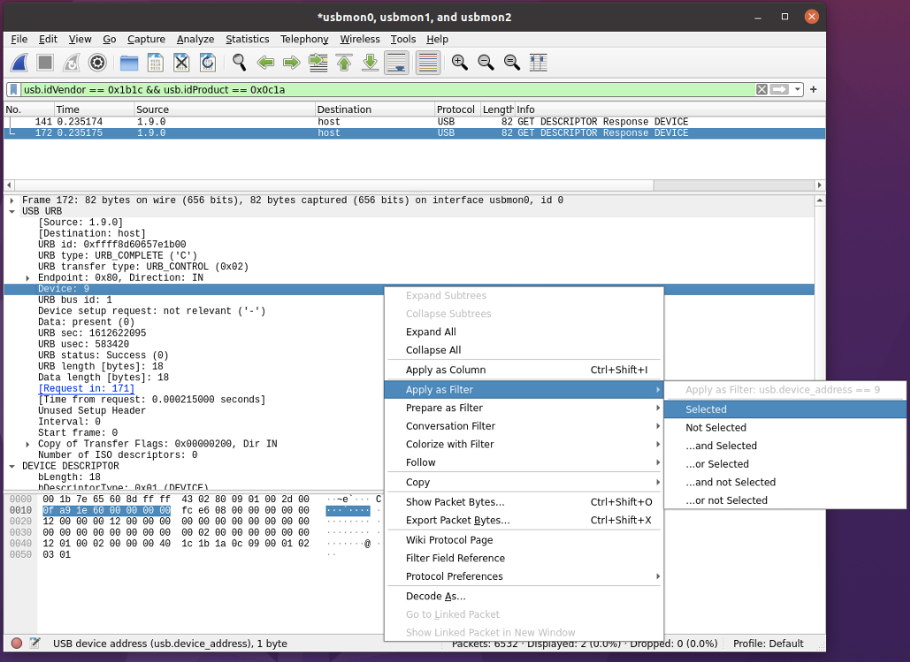
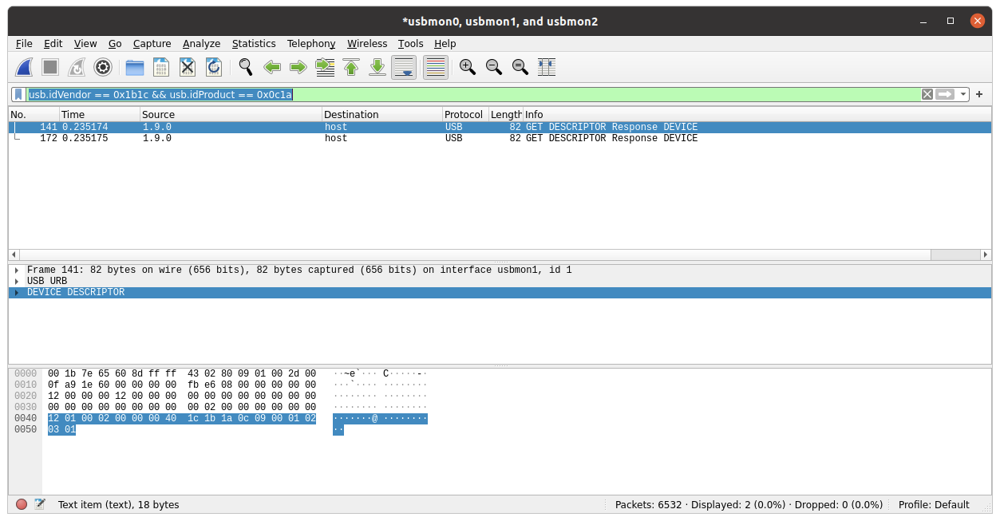

# Capturing USB traffic

## Preface

A fundamental aspect of developing drivers for USB devices is inspecting the
traffic between applications and the device.

This is useful for debugging your own drivers and applications, as well as to
understand undocumented protocols.

In the latter case, a possibly opaque and closed source application is allowed
to communicate with the device, and the captured traffic is analyzed to
understand what the device is capable of and what it expects from the host
application.


## Capturing USB traffic on a native Windows host

Get [Wireshark].  During the Wireshark setup, enable the installation of
USBPcap for experimental capturing of USB traffic.  Reboot.

To capture some USB traffic, start Wireshark, double click the USBPcap1
interface to start capturing all traffic on it, and proceed to [Finding the target device](#finding-the-target-device).

_If you have more than one USBPcap interface, you may need to look for the
target devices in each of them._


## Capturing USB traffic on Linux
_and capturing USB traffic in a Windows VM, through the Linux host_

You will need to install [Wireshark] from your favorite package manager.

You may have to run Wireshark as root to be able to capture USB traffic.
Alternatively you can give the your normal user permissions to capture traffic by
adding your self to the `wireshark` group and granting yourself read permissions on the `/dev/usbmon*` devices.
Some extra steps may be needed, you can follow the instructions [here](https://wiki.wireshark.org/CaptureSetup/USB).
Note you may need to logout and login agin for these changes to take effect.

The general steps are as follows:

1. [Create and configure a Windows VM](./creating-vm-for-capture.md).
2. Start listening for the device USB traffic on Wireshark.
4. Start changing device settings using the application running in the Windows VM and watch the messages appear in the Wireshark interface running on the host OS.
5. Success!

To capture USB traffic after setting up the VM, start Wireshark and select the appropriate `usbmon` interface for capturing traffic to your device.  You can select them on the main screen, or in the Capture -> Options menu.  If you aren't sure which usbmon device is correct, select them all then proceed to [Finding the target device](#finding-the-target-device).



## Finding the target device
[Finding the target device](#finding-the-target-device)

Wireshark captures USB traffic at the bus level, which means that all devices
on that bus will be captured.  This is a lot of noise, so the first step is
find the target device among all others and filter the traffic to that device.

_For this example, assume the target device has vendor and product IDs `0x1b1c`
and `0x0c1a`, respectively._

First, capture some USB traffic and apply a filter to the captured traffic (via the top bar) to filter out everything except the `GET DESCRIPTOR` response for this device. 

```
usb.idVendor == 0x1b1c && usb.idProduct == 0x0c1a
```
  


Next step is to get the device address so that we can tell wireshark to only capture traffic to our desired device.
Select one of the `GET DESCRIPTOR` response packets, expand the USB URB section in the packet details, and find the "Device: #" line. This is the device address.   Right click the "Device: #" entry, choose "Apply As Filter", then "Selected".  In the screenshot below the device number was 9.
  

This will change your packet filter to something like `usb.device_address == 9`, which is exactly what we want.  Now only traffic sent to that specific device will be displayed.
  

For convenience, you may want to save your filter for future captures.  Click on the bookmark icon immediately next to the filter to save it.


## Exporting captured data

There are two main useful ways to work with Wireshark captures of USB traffic.

The first is within Wireshark itself, using its native PCAP format (or any of
its variants), which is useful for manual analysis.  _PCAP files are also the
preferred way of storing and sharing captured USB traffic._

You can simply File -> Save to export captured traffic from Wireshark.  But for
more control over what will be exported (for example, only currently
filtered/displayed packets), File -> Export Specified Packets is generally
preferred.

The other way of analyzing USB traffic is through external, and sometimes
custom, tools.  In theses cases it may be helpful to additionally export the
data to JSON (File -> Export Packet Dissections -> As JSON).  Plain text or CSV
dissections are _not_ very useful with USB data, since Wireshark tends to
truncate the long fields that are of our interest.

## Next steps

Once you have your usb capture (probably in a `pcapng` format). You may find it easer to look at the data outside
of Wireshark since Wireshark sometimes limits the number of bytes shown to fewer then the amount you want to look at.

I generally like to use `tshark`, one of the cli tools that comes with Wireshark to extract the only the fields I care about
so that I can easily only show the fields I can about and can use other bash commands to separate the fields and remove
some of the extraneous messages (for example Corsair iCue sends a get status message every second which I am generally not
interested in).

Next steps would be to take a look at [analyzing USB protocols](techniques-for-analyzing-usb-protocols.md)

[Wireshark]: https://www.wireshark.org
[USBPcap]: https://desowin.org/usbpcap/