## Virtual Machine Setup for Traffic Capture

Capturing traffic between the source application running in a VM and your device requires a little setup, but once in place gives you a handy tool to capture USB traffic.  There are a few nuances of which you should be aware to correctly set up a VM for USB traffic capture, and this doc will walk through the steps required using a reference configuration in an attempt to make the steps as clear as possible.  Your configuration will likley differ from the reference configuration, but hopefully having a working reference will be helpful to adapt to your environment. 

#### Reference Configuration ####
- Virtual Machine Manager: [virt-manager](https://virt-manager.org/)
- Guest OS: Windows 10 64-bit 
- Host OS: Ubuntu 20.04
- Source application: Corsair iCue  

In short, the reference configuration will be running Corsair iCue in the Windows 10 guest VM, and capturing the device USB traffic in Wireshark running in the Ubuntu host OS.

### Basic Steps ###
1. Enable Virtualization in your BIOS
2. Install a Virtual Machine manager.
3. Create a  Windows VM
4. Install and run your device controlling software in the Windows VM (Corsair iCue in this example).
5. Capture the traffic.


### Step 1. Enable Virtualization in your BIOS

Ensure your motherboard enables hardware support for Intel VT-x or AMD-v.  These features are required in order to run a 64-bit VM, or have a VM that supports more than 1 CPU core.   In most modern motherboards these features are disabled by default, so you may need to enable them in your BIOS.  The exact setting to check is motherboard dependent, but should be something in the "virtualization" universe.  [This post](https://forums.virtualbox.org/viewtopic.php?f=1&t=62339) lists a few of the common settings, but to save you a click you can look for the following:
- "Enable Virtualization Technology", 
- "Enable SVM Mode" (AMD CPUs), 
- "Enable Vanderpool Technology" (Intel)
- "Secure Virtual Mode"
- "Intel (VMX) Virtualization Technology"

If you poked around and can't find a setting that seems right, and your motherboard is somewhat recent, then it might be enabled by default and you can just move on the next step.  You will know for sure whether it is enabled if you are unable to create a 64 bit windows 10 VM in step 3.  If that's the case, then you'll need to look harder for the setting in your BIOS, or get your Google on.

If you do make any changes in your BIOS then do a power cycle (turn the computer totally off, then on) to ensure the BIOS changes are enabled.  Sometimes a reboot doesn't do it, and the extra few seconds turning the computer all the way off is a good investment to eliminate variables.


### Step 2. Install a Virtual Machine manager

There are several capable Virtual Machine managers that can be leveraged for running the Windows 10 guest VM, but [virt-manager](https://virt-manager.org/) will be used for the purposes of this document.  [VirtualBox](https://www.virtualbox.org/) is another popular choice.

Install virt-manager via your package manager of choice and start it up.
```
virt-manager
```
You might get a warning about a missing daemon running.  If so, enable the daemon.
Reboot. 


### Step 3. Create a Windows VM

With the hardware all set to go and virt-manager installed, its time to create the guest VM running Windows 10.  
First, download the Windows 10 ISO:  https://www.microsoft.com/en-in/software-download/windows10ISO

Start virt-manager
```
virt-manager
```
After Virtual Machine Manager opens, create a new VM by selecting File -> "Create New Virtual Machine", or click this icon in the toolbar.  


If you see a warning message on that "Create a virtual machine" screen that KVM is not available, then this is a sign that virtualization is likely disabled in your bios.  Please see step 1.  
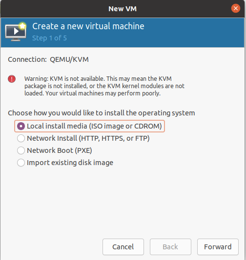  

If you continue forward without resolving this, then you are likely to encounter this scary message at some point.
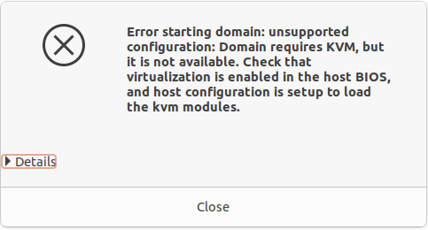  

Assuming you are all set, then ensure the "Local install media option" is selected, then select "Forward".  
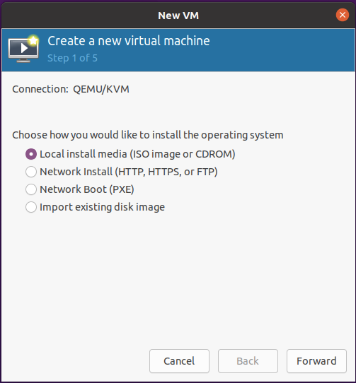  

Choose the ISO you downloaded previously, and click Forward.  
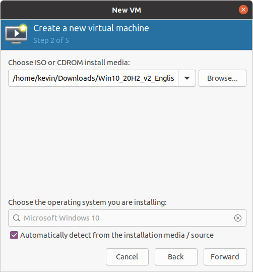  

Allocate sufficient CPU and memory (I chose 2 CPU and 4 GB of memory).  Click Forward.
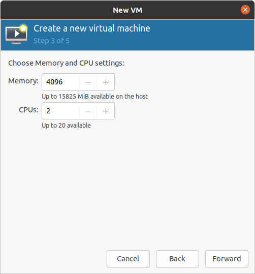  

Next choose as much disk space as you deem necessary (I chose 50GB).  Click Forward.
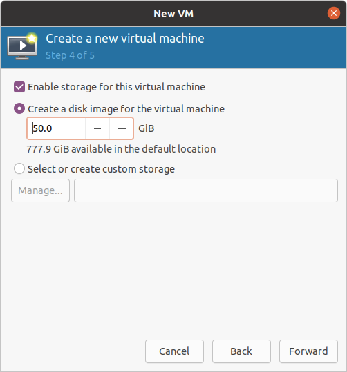  

In the last screen, check "Customize configuration before install, and click Finish.
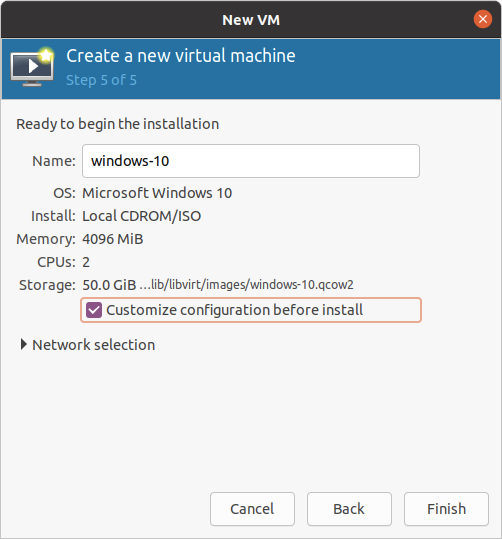  

This will take you to this screen:
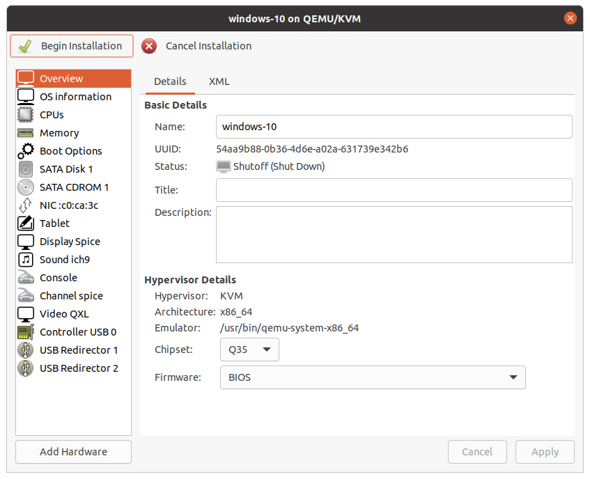  

This is the screen that enables you to make your attached devices available to the guest VM.  The reference machine used in this doc has a Corsair Lightning Node Core, Corsair Commander Pro, and Corsair H100i RGB Pro XT attached, so all three of them need to be added.  
To make them available to the guest VM, click "Add Hardware", then select "USB Host Device".  The right side of the screen will list off the USB devices attached to your motherboard.  Select the device you would like to add and click Finish. 
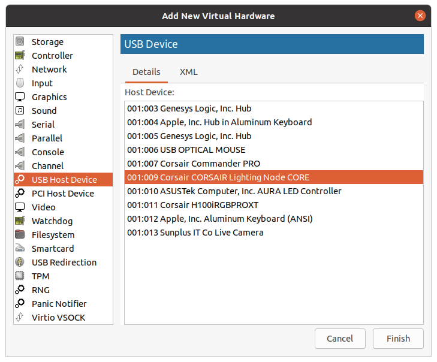  

Repeat this for each device you would like to add to your guest VM.  Once added, they will show up in your VMs hardware list.  In the screenshot below, the 3 Corsair devices that were added are shown as the 3 USB devices.
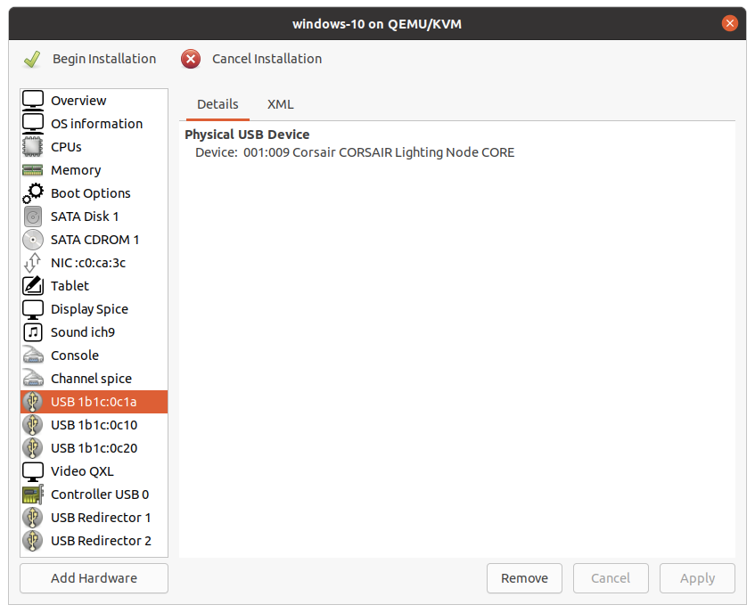  

Before moving on, please note your device's productId and vendorId.  These are displayed in the hardware list, and you will need them to filter your wireshark traffic.  Write down the product id and vendor id for the device whose traffic you will be monitoring.  

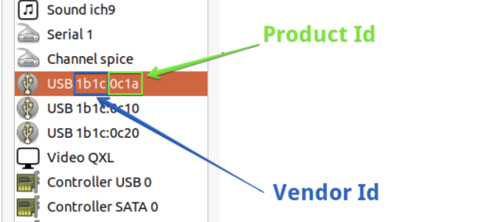

Then, click "Begin Installation" in the non-obvious upper left corner and follow the on-screen instructions to install Windows 10.


### Step 4. Install and run your device controlling software in the Windows VM.

Once Windows 10 is installed, install the software that will control your device.  In the case of a Corsair device, the software is Corsair iCue.  Download the latest version from Corsair's website and install it.  When you run it for the first time, it should auto-detect your devices, allowing you to control them as you see fit.  
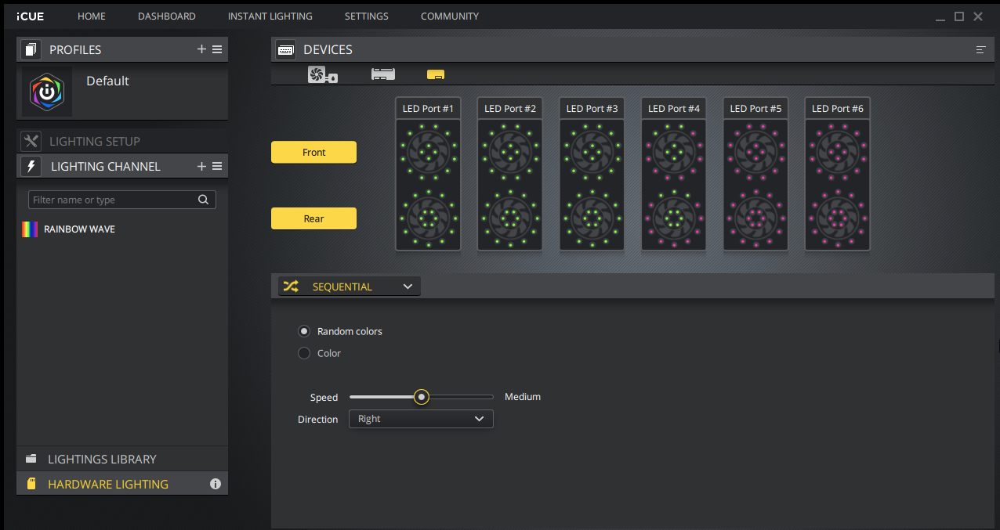  


### Step 5. Capture the traffic.

At this point you should be all set to start capturing taffic between the guest VM and the host device. Follow the instructions for [finding the target device](./capturing-usb-traffic.md#finding-the-target-device) on the Capturing USB traffic page.


